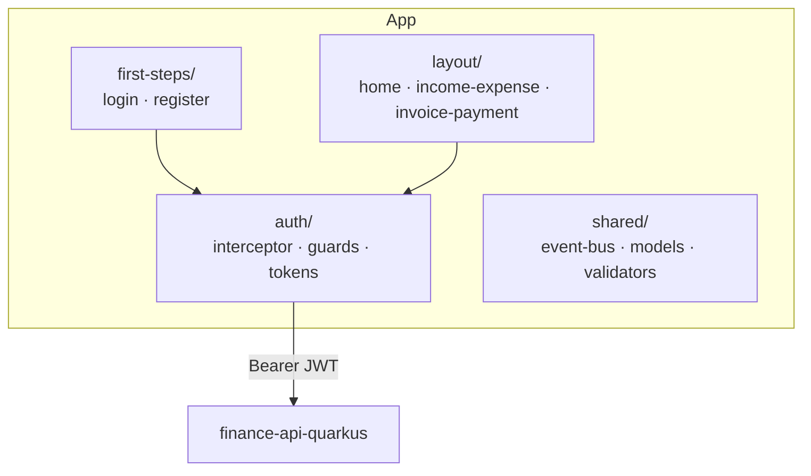

<h1 align="center">Finance Manager — Web</h1>

<p align="center">
  Angular single-page web client for multi-tenant financial management, with JWT auth and interactive dashboards.
</p>

<p align="center">
  
  
  
  
  
</p>

---

## Overview

**Finance Manager — Web** is the browser client of a three-platform financial-management product. It authenticates against the [`finance-api-quarkus`](https://github.com/renanbambam/finance-api-quarkus) backend with JWTs and provides dashboards to manage incomes, expenses, invoices and payments per enterprise.

Part of the same product family:

| Tier | Repository | Stack |
|------|-----------|-------|
| API | [`finance-api-quarkus`](https://github.com/renanbambam/finance-api-quarkus) | Java 21 · Quarkus · MongoDB |
| **Web client (this repo)** | `finance-manager-web` | Angular 16 |
| Mobile client | [`finance-manager-mobile`](https://github.com/renanbambam/finance-manager-mobile) | React Native · Expo |

---

## Features

- **JWT authentication** with login/register flows, token storage and automatic attachment via an HTTP interceptor.
- **Route protection** — `AuthGuard` / `LoginGuard` guard authenticated and guest-only routes.
- **Lazy-loaded feature modules** — `first-steps` (auth), `layout` (app shell), income-expense and invoice-payment domains.
- **Dashboards** — financial charts via Chart.js.
- **Decoupled messaging** — an `EventBus` service for cross-component communication.
- **Reusable shared layer** — typed models, validators and a feedback (`imessage`) component.

---

## Architecture



| Area | Path | Responsibility |
|------|------|----------------|
| Auth | `src/app/auth/` | Interceptor, route guards, token service |
| Onboarding | `src/app/first-steps/` | Login & register (lazy modules) |
| App shell | `src/app/layout/` | Header, home dashboard, income-expense, invoice-payment, offcanvas |
| Shared | `src/app/shared/` | Event bus, domain models, validators, message UI |

---

## Getting started

### Prerequisites
- Node.js 18+
- Angular CLI 16
- A running [`finance-api-quarkus`](https://github.com/renanbambam/finance-api-quarkus) instance (default origin `http://localhost:4200` is allowed by the API's CORS config)

### Run
```bash
npm install
npm start        # ng serve → http://localhost:4200
```

### Build & test
```bash
npm run build    # production build → dist/
npm test         # Karma unit tests
```

---

## Tech stack

`Angular 16` · `TypeScript` · `Bootstrap 5` · `Chart.js` · `@auth0/angular-jwt` · `jwt-decode` · `ngx-cookie-service` · `RxJS`
